# Physical Media Vault

A personal catalogue app for tracking physical media collections — Blu-ray, 4K UHD, DVD, and more. Built with React, TypeScript, and Supabase.


## Screenshots

### Collection

| Main View | Nested Titles | Add New Title |
|---|---|---|
| 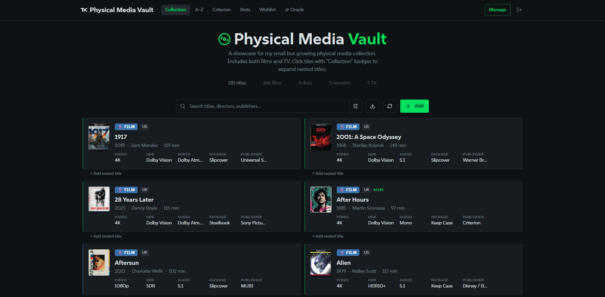 | 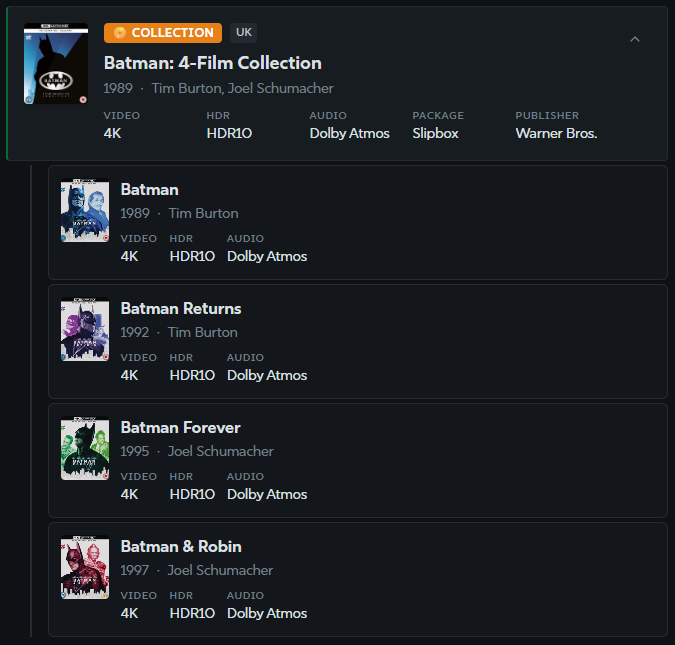 | 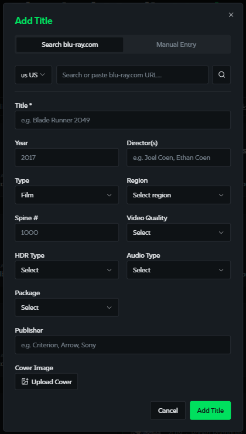 |

### Stats

| Overview | Decade Breakdown | Top Directors |
|---|---|---|
| 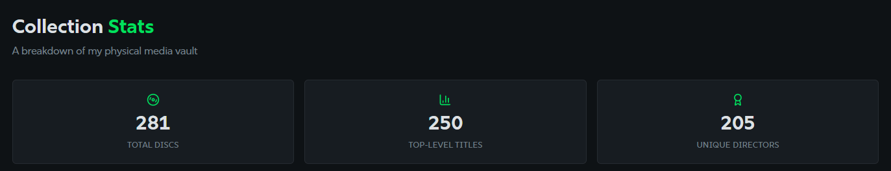 | 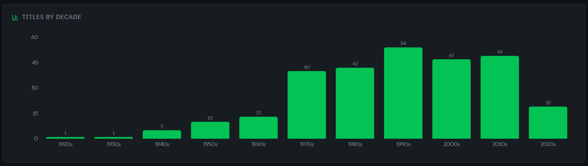 | 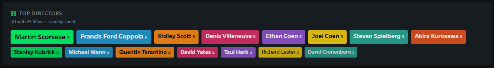 |

| Audio, Video & HDR | Other |
|---|---|
| 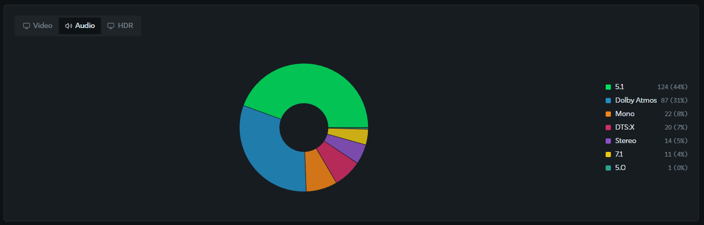 | 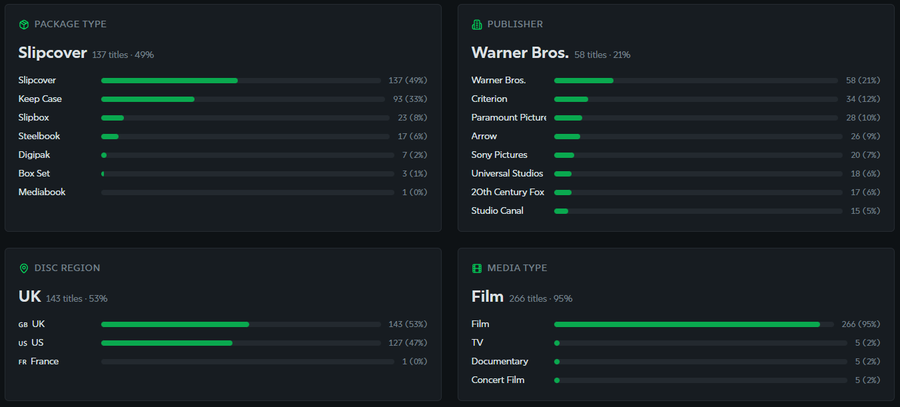 |

### Wishlist

| Wishlist | Add Item | Purchased |
|---|---|---|
| 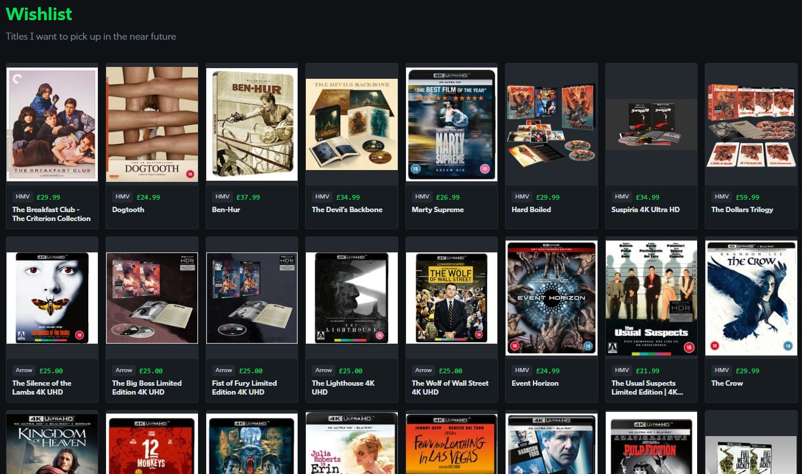 | 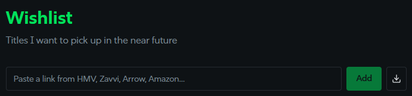 | 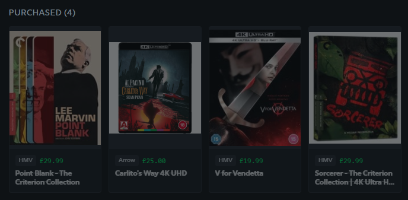 |

### Criterion

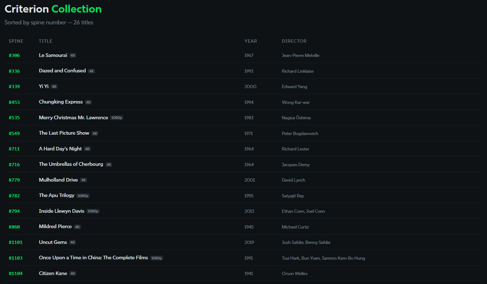

### Alphabetical

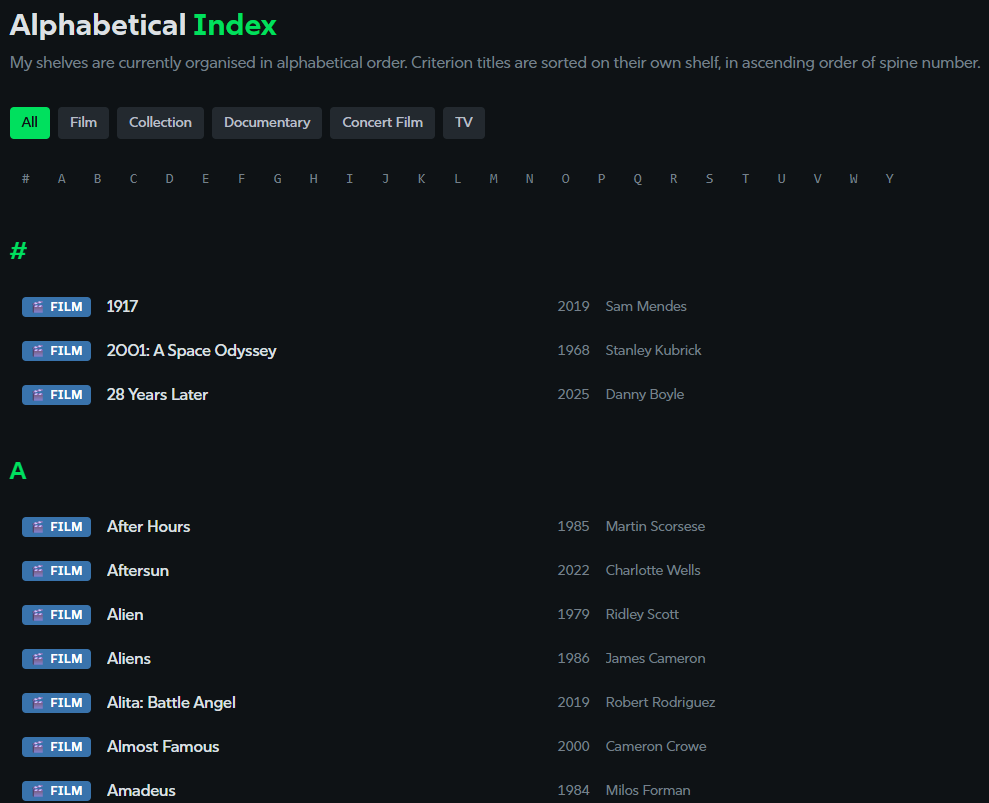

### The Oracle

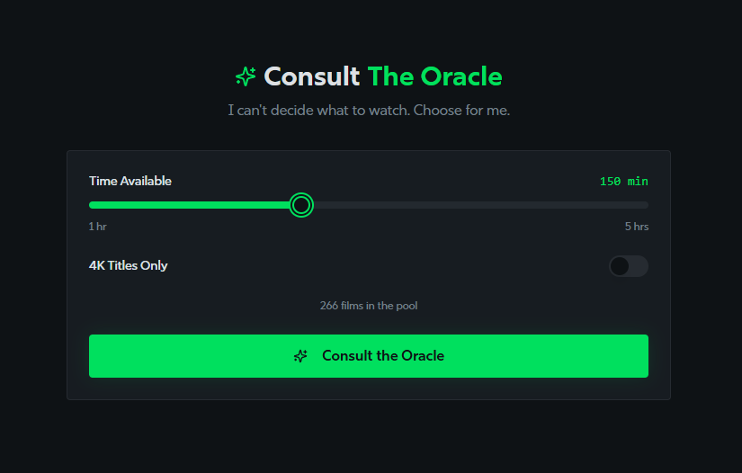

## Blog Post

📝 [Building a Physical Media Showcase with Lovable](https://thamara.co.uk/building-a-physical-media-showcase-with-lovable/)

## Features

- 📀 Track your physical media collection with rich metadata (director, year, audio, HDR, region, etc.)
- 🔍 Search and browse by title, alphabetically, or by Criterion spine number
- 📊 Collection statistics and breakdowns
- 🎯 Wishlist management with URL scraping
- 🔮 The Oracle — a random film picker to cure decision paralysis
- 🖼️ Cover art via Blu-ray.com API integration
- 🔐 Per-user authentication and row-level security

## Tech Stack

- **Frontend:** React 18, TypeScript, Vite, Tailwind CSS, shadcn/ui
- **Backend:** Supabase (Postgres, Auth, Edge Functions, Storage)
- **State:** TanStack React Query

## Getting Started

### Prerequisites

- [Node.js](https://nodejs.org/) 18+ (recommend using [nvm](https://github.com/nvm-sh/nvm))
- A [Supabase](https://supabase.com/) project (free tier works fine)

### 1. Clone the repo

```bash
git clone https://github.com/YOUR_USERNAME/physical-media-vault.git
cd physical-media-vault
```

### 2. Install dependencies

```bash
npm install
```

### 3. Configure environment

Copy the example env file and fill in your Supabase credentials:

```bash
cp .env.example .env
```

Edit `.env` with your Supabase project URL and anon key (both are safe to expose client-side).

### 4. Set up the database

Run the SQL migrations in `supabase/migrations/` against your Supabase project, either via the Supabase dashboard SQL editor or the Supabase CLI:

```bash
npx supabase db push
```

### 5. Configure secrets

The following secrets need to be set in your Supabase project's Edge Function secrets (via the dashboard or CLI):

| Secret              | Purpose                          |
| ------------------- | -------------------------------- |
| `FIRECRAWL_API_KEY` | URL scraping for wishlist items  |

### 6. Start the dev server

```bash
npm run dev
```

The app will be available at `http://localhost:5173`.

## Design Language

The UI takes inspiration from [Letterboxd](https://letterboxd.com/) — a dark, cinematic aesthetic built for browsing media collections.

### Typography

- **Primary typeface:** [Rig Sans](https://fonts.adobe.com/) (via Adobe Fonts)
- Used for all body text, headings, and UI elements
- Headings use `font-weight: 700`

> **Note for contributors:** Rig Sans is loaded from a domain-locked Adobe Fonts kit and will **not** render for local development or forks. The app falls back gracefully to `system-ui, sans-serif`. If you'd like the same typeface locally, create your own [Adobe Fonts](https://fonts.adobe.com/) account, add Rig Sans to a kit, whitelist your dev domain, and update the kit ID in `index.html`.

### Colour Palette

| Role | Hex | HSL | Usage |
|---|---|---|---|
| **Background** | `#101519` | `210 20% 7%` | Page background |
| **Foreground** | `#D8DCE0` | `210 10% 88%` | Primary text |
| **Card** | `#181D23` | `210 18% 11%` | Card / panel surfaces |
| **Surface Elevated** | `#1C2129` | `210 16% 13%` | Raised surface elements |
| **Muted** | `#1F2429` | `210 14% 14%` | Subdued backgrounds |
| **Muted Foreground** | `#737A80` | `210 8% 50%` | Secondary / placeholder text |
| **Border** | `#262C33` | `210 12% 17%` | Borders and dividers |

### Accent Colours

| Role | Hex | HSL | Usage |
|---|---|---|---|
| **Primary (Green)** | `#00E054` | `145 100% 44%` | Primary actions, links, active states |
| **Green Dim** | `#1B7237` | `145 60% 28%` | Subtle green borders and accents |
| **Orange** | `#FF8000` | `30 100% 50%` | Secondary accent, warnings |
| **Destructive** | `#E03E3E` | `0 72% 50%` | Delete actions, errors |

### Media Type Badges

| Type | Hex | HSL |
|---|---|---|
| Film | `#3D6DB8` | `210 50% 45%` |
| Film Collection | `#CC7A1A` | `30 80% 50%` |
| Documentary | `#30994D` | `145 50% 38%` |
| Concert Film | `#B83D78` | `330 55% 48%` |
| TV | `#6633CC` | `265 50% 50%` |

### Video Quality Accents

Collection cards use a subtle **2px left-border** to indicate video quality:

- **4K UHD:** Green (`#00E054`)
- **1080p:** Blue (`#3D6DB8`)

### Design Tokens

All colours are defined as HSL CSS custom properties in `src/index.css` and mapped to Tailwind classes in `tailwind.config.ts`. Components use semantic tokens (`bg-primary`, `text-foreground`, `bg-card`, etc.) rather than hardcoded values — see [CONTRIBUTING.md](CONTRIBUTING.md) for guidelines.

## Project Structure

```
src/
├── components/      # Reusable UI components
├── hooks/           # Custom React hooks (auth, data fetching)
├── integrations/    # Supabase client & generated types
├── lib/             # Utilities and API helpers
├── pages/           # Route-level page components
supabase/
├── functions/       # Edge Functions (bluray-search, scrape-wishlist-url)
├── migrations/      # Database schema migrations
```

## Data Privacy

Your personal collection data is stored securely in the database and is **not** included in this repository. Only the source code, configuration, and database schema (table structure) are committed to version control.

## Contributing

This app was built for my own personal collection needs, so it may not cover every use case. You're welcome to fork it, adapt it to your own workflow, and submit improvements back via PR.

Please read **[CONTRIBUTING.md](CONTRIBUTING.md)** for detailed guidelines on setup, code style, and the PR process.

## License

This project is licensed under the MIT License — see the [LICENSE](LICENSE) file for details.
